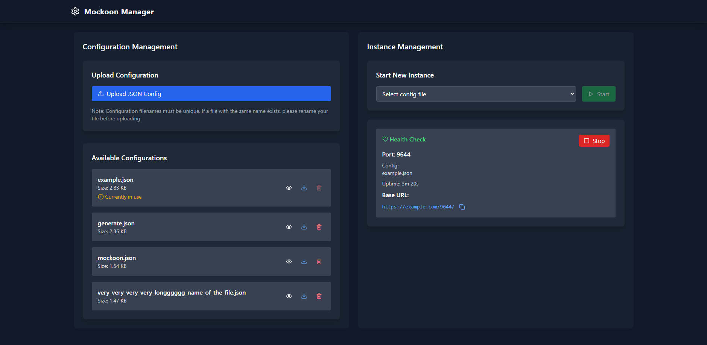

# 🚀 Mockoon Manager

A web-based management interface for running and managing multiple [Mockoon CLI](https://mockoon.com/cli/) instances.



## ✨ Features

- 📝 Upload and manage multiple Mockoon configuration files
- 🔄 Start/stop multiple mock API instances
- 🔍 Monitor running instances with health checks
- 🎯 Dynamic port allocation
- 💫 Real-time status updates
- 🔗 Easy access to mock API endpoints

## 💡 Getting Started with Mockoon

You can easily create and manage your mock APIs using this tool:

1. **Create Mock APIs**:
   - Download and install [Mockoon Desktop](https://mockoon.com/download/) application
   - Design your API endpoints using the intuitive GUI
   - Export your configuration as JSON file
   - Upload the JSON through Mockoon Manager web interface

2. **Access Your Mocks**:
   - Once uploaded and started, your mock APIs are accessible via `http(s)://your-domain/:port/your-endpoint`
   - Perfect for sharing mock APIs with your team or accessing them from anywhere
   - Useful for development, testing, and demonstrations

3. **Best Practices**:
   - Give your configuration files descriptive names
   - Include version numbers in your config filenames (e.g., `user-api-v1.json`)
   - Test your configurations locally in Mockoon Desktop before uploading
   - Use the automatic health check endpoint to monitor instance status

## 🔧 Requirements

- Node.js (v16 or higher)
- PM2 (installed globally)
- Mockoon CLI (installed globally)
- Nginx (for production deployment)

```bash
# Install global dependencies
npm install -g pm2 @mockoon/cli
```

## 🚀 Quick Start

1. Clone the repository:
```bash
git clone https://github.com/yourusername/mockoon-manager.git
cd mockoon-manager
```

2. Install dependencies for both frontend and backend:
```bash
# Install backend dependencies
cd backend
npm install

# Install frontend dependencies
cd ../frontend
npm install
```

3. Configure environment variables:
```bash
# Backend (.env)
PORT=3500
UPLOAD_DIR=uploads
CONFIGS_DIR=configs

# Frontend (.env)
VITE_API_URL=/api
```

4. Start the development servers:
```bash
# Start backend
cd backend
npm start

# Start frontend (in a new terminal)
cd frontend
npm run dev
```

## 🏗️ Production Deployment

1. Create necessary directories:
```bash
# In backend directory
mkdir -p configs uploads logs
```

2. Configure Nginx:
- Copy the provided `nginx.conf` to your Nginx configuration directory
- Update the server_name and SSL certificate paths
- Adjust the proxy_pass IP addresses as needed

3. Process Management:
Both frontend and backend use PM2 for process management. The configuration is in their respective `process.json` files:

**Backend process.json**:
```json
{
  "apps": [{
    "name": "be-mockoon-manager",
    "script": "server.js",
    "watch": false,
    "env": {
      "NODE_ENV": "production"
    }
  }]
}
```

**Frontend process.json**:
```json
{
  "apps": [{
    "name": "fe-mockoon-manager",
    "script": "serve -s dist",
    "watch": false,
    "env": {
      "NODE_ENV": "production"
    }
  }]
}
```

4. Use the provided `restart.sh` script to manage the application:
```bash
chmod +x restart.sh
./restart.sh
```

The restart script will:
- Safely stop existing Mockoon Manager processes
- Install dependencies
- Build the frontend
- Start both frontend and backend using their PM2 configurations
- Save the PM2 process list for persistence

## 📁 Project Structure

```
mockoon-manager/
├── assets/
│   ├── nginx.conf
│   └── preview.png
├── backend/
│   ├── configs/        # Mockoon configuration files
│   ├── uploads/        # Temporary upload directory
│   ├── logs/          # Instance logs
│   └── server.js
├── frontend/
│   ├── src/
│   └── public/
├── restart.sh
└── README.md
```

## 🔒 Security

- All mock instances run on ports between 9001-9999
- Upload size is limited to 5MB
- Only JSON configuration files are accepted
- Ensure proper file permissions:
```bash
chmod 755 backend/configs
chmod 755 backend/uploads
chmod 755 backend/logs
```

## 🔌 API Endpoints

### Management API
- `GET /api/health` - Health check endpoint
- `GET /api/mock/status` - Get status of all running instances
- `GET /api/mock/configs` - List available configurations
- `POST /api/mock/upload` - Upload new configuration
- `POST /api/mock/start` - Start a mock instance
- `POST /api/mock/stop` - Stop a mock instance
- `DELETE /api/mock/configs/:filename` - Delete configuration
- `GET /api/mock/configs/:filename/download` - Download configuration

### Mock Instances
- `GET /:port/healthz` - Health check for specific instance
- `GET /:port/*` - Access mock API endpoints

## 🛠️ Tech Stack

- **Frontend**: 
  - React 18
  - Vite
  - TailwindCSS
  - Axios
  - React Hot Toast
  - Lucide React (icons)
  - Headless UI
- **Backend**: 
  - Node.js
  - Express
  - Multer (file uploads)
  - PM2 (process management)
- **Mock Server**: 
  - Mockoon CLI
- **Reverse Proxy**: 
  - Nginx

## 📝 Important Notes

- Each mock instance automatically includes a `/healthz` endpoint
- Configuration files are stored in the `backend/configs` directory
- Logs are available in the `backend/logs` directory
- The application uses polling for status updates (5-second interval)
- Default ports:
  - Frontend: 3000 (production)
  - Backend: 3500
  - Mock instances: 9001-9999
- Ensure your system has sufficient ports available in the 9001-9999 range
- Monitor the logs directory for individual instance logs
- Nginx configuration is crucial for proper routing

## 🔧 Troubleshooting

1. Port Conflicts:
```bash
# Check if ports are in use
netstat -tln | grep '3000\|3500\|900'
```

2. Permission Issues:
```bash
# Ensure proper ownership
sudo chown -R $USER:$USER backend/configs backend/uploads backend/logs
```

3. PM2 Issues:
```bash
# View PM2 logs
pm2 logs

# List PM2 processes
pm2 list
```

## 🤝 Contributing

Contributions are welcome! Please feel free to submit a Pull Request.

1. Fork the repository
2. Create your feature branch (`git checkout -b feature/AmazingFeature`)
3. Commit your changes (`git commit -m 'Add some AmazingFeature'`)
4. Push to the branch (`git push origin feature/AmazingFeature`)
5. Open a Pull Request

## 📄 License

This project is licensed under the MIT License with additional disclaimers - see the [LICENSE](LICENSE) file for details.

⚠️ **Disclaimer**: This software is provided "as is" without warranty of any kind. The author(s) accept no responsibility for any consequences resulting from the use of this software.